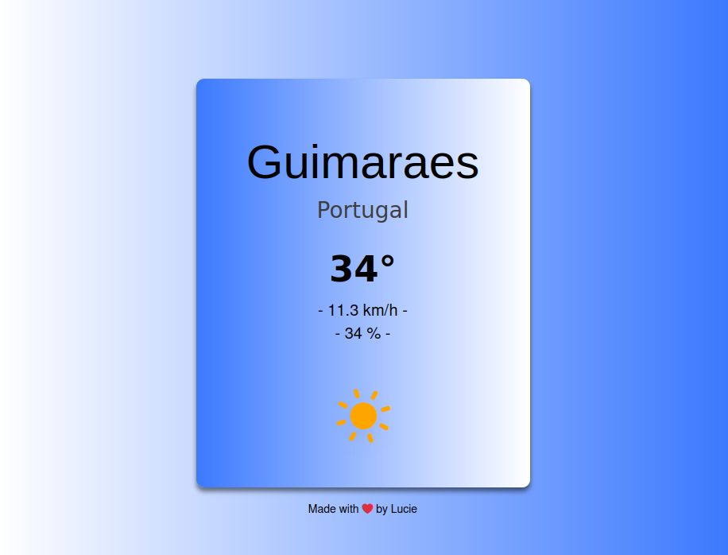

# Meteoapp

Ce projet react utilise une API météo pour afficher les données météorologiques selon la ville la plus proche (géolocalisation avec l'addresse IP).\
On a la ville, le pays, la température actuelle (en degré Celsius évidemment), la vitesse du vent (en km/h) et le pourcentage d'humidité.

L'API utilisé est celle de "iqair.com".

